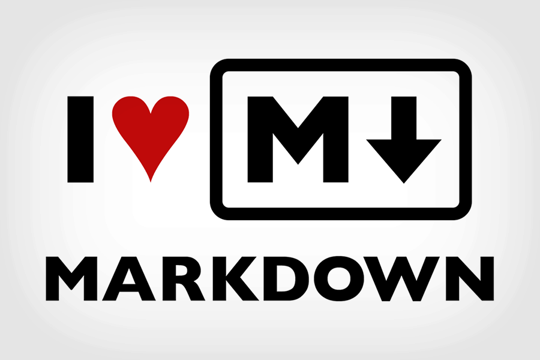

    

<h1 align="center">
  Bootcamp Pre-Course
</h1>

## Overview

Thank you for applying for the School of Code bootcamp, and congratulations on taking the first step on your coding journey! Work your way through the activities below to get set up for coding success and build a strong foundation in web development.

TODO: Finish this intro wording. Reference that it'll prepare people for the course if accepted and still be valuable if not (and mention that people who aren't successful can reapply, and having done this learning will help them be more successful next time).

### Objectives

By the end of this material, you'll be able to:

- Have your development environment (VS Code and other necessary software) set up so you're ready to code
- Understand how information flows over the internet
- Use Markdown, a markup language developers use when documenting and commenting on code
- Use HTML to build a static webpage and CSS to style it
- Start to become acquainted with the basics of JavaScript

## Learning Journey 🗺

### Setting up your development environment to get ready to code

Your IDE (integrated development environment) will be where you write your code during this course, and although there are many options out there, the one we use is Visual Studio Code (usually just referred to as VS Code). VS Code is infinitely customisable with extensions, and it has an integrated terminal, live share, and other handy capabilities that make our coding life easier. Watch [this video](https://code.visualstudio.com/docs/introvideos/basics) to get started with the basics. Then spend some time just familiarising yourself with the program and practice the keyboard shortcuts. You can find a printable shortcut reference [here (Mac)](https://code.visualstudio.com/shortcuts/keyboard-shortcuts-macos.pdf) or [here (Windows)](https://code.visualstudio.com/shortcuts/keyboard-shortcuts-windows.pdf) or in the home screen of VS Code. You can also find a [searchable reference here](https://vscode-shortcuts.com/).

After you have your VS Code installed, follow the guide below relevant to your operating system on how to get prepared with all the other necessary software to code during the bootcamp:

- TODO: MAC VERSION OF SETUP GUIDE HERE
- TODO: WINDOWS VERSION OF SETUP GUIDE HERE

### How the internet works

What even is the internet? Is it different to the world wide web? How does it actually work? What happens to the information that flows back and forth? These are things we should know if we are going to start building websites, web apps and projects.

We've selected three videos for you to watch from a series of YouTube videos that are a whirlwind tour of everything from early computing to machine learning, robots and more! The three videos we would like you to watch are particularly relevant to the area we will be working in. The aim for us here is to gain an overview of how computers talk to each other. This will help us become more informed about what our code is doing. If you like the series, then feel free to watch more!

- [Computer Networks](https://www.youtube.com/watch?v=3QhU9jd03a0)
- [The Internet](https://www.youtube.com/watch?v=AEaKrq3SpW8)
- [The World Wide Web](https://www.youtube.com/watch?v=guvsH5OFizE)

### Getting a taste of syntax with Markdown

[Markdown](https://daringfireball.net/projects/markdown/syntax#philosophy) is a lightweight markup language designed to make it easy to write for the web, with an emphasis on being as easy-to-read and easy-to-write as possible. Developers use it to write documentation about their code and communicate on Github around issues and pull requests. The readme you're reading right now is written in Markdown, in fact. It's also used by a lot of tech bloggers to create content. For example, if you wanted to write a post on [dev.to](https://dev.to/), you'd do it in Markdown. In addition to being useful on its own, learning Markdown will help you get used to using different syntax than you might be used to to make things happen on a page, which is good practice for coding! 💪

Follow the [tutorial here](https://www.markdowntutorial.com/) to learn the basics of Markdown. You'll have a chance to practice it soon.

### HTML and CSS, the building blocks of the web

Now that your syntax muscles are limbered up, it's time to jump into HTML and CSS, which form the building blocks of the web. HTML stands for "hyper-text markup language", and CSS stands for "cascading style sheets". If a web page was a body, HTML would be its skeleton, the basic structure of the page. 🦴 💀 CSS would then be the skin, hair, clothes, jewelry, and anything else that falls under the design of the page, how it looks and how it's styled. 🩳 👗

FreeCodeCamp is a fantastic resource that makes learning HTML and CSS approachable and fun. Work your way through [the Responsive Web Design activities here](https://www.freecodecamp.org/learn/responsive-web-design/) and/or their full [Learn HTML5 and CSS3 From Scratch video course here](https://www.youtube.com/watch?v=mU6anWqZJcc).

Alongside FreeCodeCamp, we'd also like you to complete Scrimba's short [Learn UI Design Fundamentals course](https://scrimba.com/learn/design) to help you learn basic design principles that help you create user interfaces with your HTML and CSS that both look good and function well.

### First steps into JavaScript

TBC

## TODO: Project section - define wording!

TODO: Project description here! (FCC tribute page. Form page too?) FCC projects are in Codepen. Is it reasonable to ask for them to do it in Codepen for FCC's tests and then move it to a GH repo? We can provide the classroom link with starter files to make it easier!

TODO: Ask them to do a readme in MD (the "practice soon" referenced in the MD section above)

## Further Resources

- TBC
