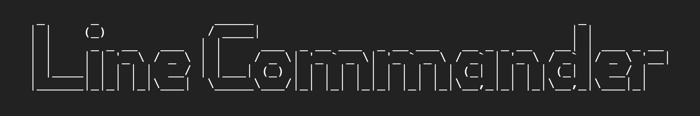

    

<h1 align="center">
  Bootcamp Pre-Course
</h1>

## Overview

Congratulations on making it on to the School of Code bootcamp, and taking the first step on your coding journey! The following tasks are designed so that we can hit the ground running on the first day of the bootcamp. Work your way through the activities below to get set up for coding success and build a strong foundation in web development. Completing all of the activities in this guide will be essential before day one of the course, and will mean that you're up to speed with where the curriculum will start.

### Objectives

By the end of this material, you'll be able to:

- Set up a development environment (VS Code and other necessary software) so you're ready to start coding.
- Understand how information flows over the internet.
- Use Markdown, a markup language developers use when documenting and commenting on code.
- Use HTML to build a static webpage and CSS to style it.
- Start to become acquainted with the basics of JavaScript.
- Know the basics of Git and GitHub for version control.
- Start navigating through your computer using the command line.
- Create the first project in your portfolio.

## Learning Journey 🗺

### Setting up your development environment to get ready to code

Your IDE (integrated development environment) will be where you write your code during the course. Although there are many options out there, the one we use is Visual Studio Code (usually just referred to as VS Code). VS Code is infinitely customisable with extensions, and it has an integrated terminal, live share functionality (think two people editing a Google doc at the same time), and other handy capabilities that make our coding life easier.

Watch [this video](https://code.visualstudio.com/docs/introvideos/basics) to get started with the basics. After that, spend some time familiarising yourself with the program and practice the keyboard shortcuts. You can find a printable shortcut reference [here (Mac)](https://code.visualstudio.com/shortcuts/keyboard-shortcuts-macos.pdf) or [here (Windows)](https://code.visualstudio.com/shortcuts/keyboard-shortcuts-windows.pdf) or in the home screen of VS Code. You can also find a [searchable reference here](https://vscode-shortcuts.com/).

[This guide](https://www.canva.com/design/DAEhRtVI350/sFbhxfM4nTfe7N4bJu7EnQ/view#1) will help you install VS Code along with the other software you'll need. Follow the instructions on each page that pertain to your operating system.

### How the internet works

What even is the internet? Is it different to the world wide web? How does it actually work? What happens to the information that flows back and forth? These are things we should know if we are going to start building websites, web apps and projects.

We've selected three videos for you to watch from a series of YouTube videos that are a whirlwind tour of everything from early computing to machine learning, robots and more! The three videos we would like you to watch are particularly relevant to the area we will be working in. The aim for us here is to gain an overview of how computers talk to each other. This will help us build our mental model for how the code we write makes things happen in the real world. If you like the series, then feel free to watch more!

- [Computer Networks](https://www.youtube.com/watch?v=3QhU9jd03a0)
- [The Internet](https://www.youtube.com/watch?v=AEaKrq3SpW8)
- [The World Wide Web](https://www.youtube.com/watch?v=guvsH5OFizE)

### Getting a taste of 'syntax' with Markdown

[Markdown](https://daringfireball.net/projects/markdown/syntax#philosophy) is a lightweight markup language designed to make it easy to write for the web, with an emphasis on being as easy-to-read and easy-to-write as possible. Developers use it to write documentation about their code and communicate on GitHub around issues and pull requests (you'll learn about these later!) In fact, the readme you're reading right now is written in Markdown.

It's also used by a lot of tech bloggers to create content. For example, if you wanted to write a post on [dev.to](https://dev.to/), you'd do it in Markdown. In addition to being useful on its own, learning Markdown will help you get used to using a different syntax to the one you might be used to to make things happen on a page, which is good practice for coding! Syntax is the word we use for the specific text instructions we can give a computer to make it do different things. 💪

Follow the [tutorial here](https://www.markdowntutorial.com/) to learn the basics of Markdown. You'll have a chance to practice it soon.

### HTML and CSS: the building blocks of the web

Now that your syntax muscles are limbered up, it's time to jump into HTML and CSS, which form the building blocks of the web. HTML stands for "hyper-text markup language", and CSS stands for "cascading style sheets". If a web page was a body, HTML would be its skeleton, the basic structure of the page. 🦴 💀 CSS would then be the skin, hair, clothes, jewelry, and anything else that falls under the design of the page, how it looks and how it's styled. 🩳 👗

FreeCodeCamp is a fantastic resource that makes learning HTML and CSS approachable and fun. Work your way through [the Responsive Web Design activities here](https://www.freecodecamp.org/learn/responsive-web-design/) - you don't need to complete the certification; the aim is to work through the interactive activities so that you have a foundation of HTML and CSS knowledge at the beginning of the course. If you prefer to learn via video, you can watch their [Learn HTML5 and CSS3 From Scratch video course here](https://www.youtube.com/watch?v=mU6anWqZJcc) .

Alongside FreeCodeCamp, we'd also like you to complete Scrimba's short [Learn UI Design Fundamentals course](https://scrimba.com/learn/design) to help you learn basic design principles that help you create user interfaces with your HTML and CSS that both look good and function well. If you still feel like you need some extra practice, check out this [MarkSheet](https://marksheet.io/) course for another practical introduction

### Taking command with the command line

Most users interact with their modern computers using the GUI (graphic user interface) built into their operating system. This means that they can look through their files, open programs, etc. by clicking on icons like folders. 📁 However, as a programmer, you'll start to use the command line, where you type prompts into a text terminal, to tell your computer what to do directly. ⌨️ It might be weird at first, but trust us - when you get used to it, it's much faster. Plus, you'll start to feel a little bit like a hacker in a movie! 😎

Learning to navigate a computer using the command line is a skill that gives you lots of power. There are a few basic commands to learn first and more complex ones to learn later on. The important thing for you to take away is the pattern of a using a command, options and input. We've put together [this challenge](https://schoolofcode.github.io/line-commander/) for you to play through which should help you get to grips with the basics and also do some cool stuff!

### Git and version control

The image of the lone coder sitting in a dark corner tapping away in solitude is a stereotype thanks to countless movies and TV shows, but in reality, coding is a hugely collaborative endeavor. There are loads of benefits to multiple people working on the same codebase, but without a form of version control, the potential for getting wires crossed and overlapping each other's code looms. A version control system tracks all of the different changes that are being made to a coding project, so that work can be checked before being commited, or enabling us to re-wind time to an earlier version if something goes wrong.

During the bootcamp, the version control tool you'll be using is called Git. Hand in hand with Git, we'll also be using GitHub (where you're reading this right now), and once you start writing and sharing code in earnest, they'll soon become your best friends! [Watch this video](https://vimeo.com/632147610/b261a71a83) for an introduction to Git.

First, make sure you follow [the instructions here](https://www.freecodecamp.org/news/git-first-time-setup/) to ensure you've installed Git correctly and have your credentials configured correctly. This will be a good chance to start practicing interacting with your computer using the command line as well.

Play through [this fun game](https://ohmygit.org/) to learn how Git works and the advantages of using it when coding and collaborating.

Then you can follow the [tutorial here](https://product.hubspot.com/blog/git-and-github-tutorial-for-beginners) to start getting your head around combining Git with GitHub. You can use this [cheat sheet](https://education.github.com/git-cheat-sheet-education.pdf) for a quick reminder of the new command line commands you'll use when interacting with Git. If things get too complicated or you end up in a snarl, you can use [this site](https://dangitgit.com/en) to help unpick common Git issues in plain English.

### Folder structures and naming conventions

The tasks so far will have given you a taste for the power that comes from knowing how your computer works behind the scenes. Alongside this realisation, it is essential for you become more conscious of how you use and maintain your computer. Gone are the days where you mindlessly let your downloads folder fill up until your system tells you you have no space remaining on your hard drive, or 'conveniently' saving every file on your desktop for quick access until your background is completely obscured by a mosaic of icons.

You need to be in control of the folder structures where your code is saved, and adhere to [precise naming conventions](https://www.theserverside.com/feature/A-guide-to-common-variable-naming-conventions) so that other developers understand how you have categorsied your work. This is particularly important when using version control systems like Git, [which rely on tracking files at the top folder level of each project](https://hackernoon.com/understanding-git-fcffd87c15a3). Everything you do as a programmer should be purposeful - don't be led by your computer, you are in control!

### Putting it all together - your first projects

By this point, you've done a load of learning, and you might feel like you have lots of different pieces of information swimming around in your head. It's time to solidify what you learned and give you the opportunity for some creativity as well by putting that knowledge into practice.

We'd like you to complete the first project in FreeCodeCamp's Responsive Web Design certification, [the tribute page](https://www.freecodecamp.org/learn/responsive-web-design/responsive-web-design-projects/build-a-tribute-page). You can make your tribute page about anything you want. Let your personality shine through!

Your page needs to fulfill all of the user stories listed on FreeCodeCamp's requirements page. You can create a Codepen using their template and run their inbuilt test suite to check how you're doing, and then feel free to submit it to FreeCodeCamp to get your first step toward their certification. This will be great practice in building a project according to a set of requirements as user stories, just like software developers do in the tech industry.

However, we'd also like you to solidify the other knowledge you've gained in the activities above. Codepen is a great way to get started coding in the browser, but we'd like you to take it to the next level and get used to working with Git and in Github repositories. We use GitHub Classroom for our assignments during the course, so to give you your first taste of that, please click on the [classroom link here](https://classroom.github.com/a/k4EnlfqF) and accept a new assignment. This will create your own personal repository that you can then clone down.

In this repository, please:

- Take your code from the Codepen challenge and insert it into the HTML and CSS files within the repository.
- Use your new Markdown skills to write a README for the repository. In it, you can talk about why you chose the subject you chose for your tribute page as well as what you learned making it and any reflections on the development journey.
- Add, commit, and push your changes to that repository using your new Git skills on the command line in the VS Code terminal.
- Host the website using [GitHub pages](https://guides.github.com/features/pages/)

This way, you'll embed your skills and have your first project in your portfolio!

## Do you have a question or need help?

If you have any questions, comments, or discussion topics, or if you need any help, you can use the "Issues" tab at the top of this repository page. Here, if you click on "New issue", you can use the inbuilt templates or create a blank issue. Through this system, you can remotely interact with your fellow bootcampers as well as the School of Code staff.

## Further Resources

If you've finished the activities above and are hungry for more, here are some optional further resources for you to check out. We'll keep adding to this list if we discover any nifty new resources we'd like to share with you between now and the bootcamp starting, so check back often.

### Information

- [What really happens when you click on a link?](https://dev.to/katiehawcutt/what-really-happens-when-you-click-on-a-link-29o4)
- [All of the links from Quincy Larson's "Five Links Worth Your Time" emails](https://github.com/sourabh-joshi/awesome-quincy-larson-emails) - This is a really valuable newsletter sent out by the founder of FreeCodeCamp, so we'd encourage you to subscribe moving forward, but you can find all the past links here!
- Fireship's videos on the [weird history of JavaScript](https://www.youtube.com/watch?v=Sh6lK57Cuk4) and [how JavaScript works under the hood](https://www.youtube.com/watch?v=FSs_JYwnAdI)
- [PluralSight's JavaScript guide](https://www.javascript.com/learn/strings)
- [JavaScript Arrays and Objects Are Just Like Books and Newspapers](https://www.freecodecamp.org/news/javascript-arrays-and-objects-are-just-like-books-and-newspapers-6e1cbd8a1746/)
- [JavaScript object keys tutorial – how to use a JS key-value pair](https://www.freecodecamp.org/news/javascript-object-keys-tutorial-how-to-use-a-js-key-value-pair/)
- [Functional Programming in JavaScript Explained in Plain English](https://www.freecodecamp.org/news/functional-programming-in-javascript-explained-in-plain-english/)

### More hands-on practice

- If you finish your tribute page project, feel free to move on to the other projects in the Responsive Web Design certification such as the [survey form](https://www.freecodecamp.org/learn/responsive-web-design/responsive-web-design-projects/build-a-survey-form).
- You can use the activities in [FreeCodeCamp's JavaScript Algorithms and Data Structures course](https://www.freecodecamp.org/learn/javascript-algorithms-and-data-structures/) to keep practicing your JavaScript. Again, the aim isn't for you to complete the whole certification! You're building a foundation of knowledge.
